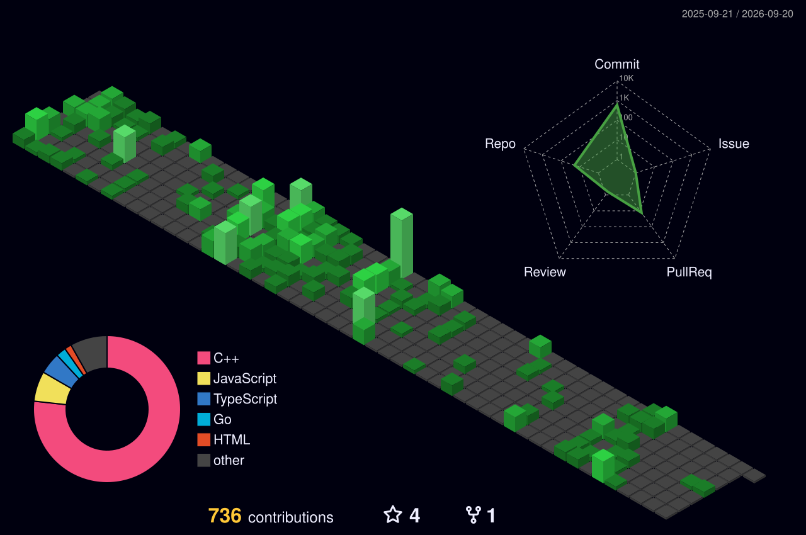

<h3 align="center">
  Hi there, I'm Dheeraj Singh Chauhan
  
</h3>

  

 

---

  <a href="https://iamdsc.vercel.app">Website</a> •
  <a href="https://www.linkedin.com/in/dheerajsinghchauhan/">LinkedIn</a> •
  <a href="mailto:dheerajsinghchauhan2004@gmail.com">Gmail</a> •
  <a href="https://www.instagram.com/dsc_virus/">Instagram</a> •
  <a>Location: Nainital/India</a> •

---

<!--
The profile images are generated at the following paths:

profile-3d-contrib/profile-green-animate.svg
profile-3d-contrib/profile-green.svg
profile-3d-contrib/profile-season-animate.svg
profile-3d-contrib/profile-season.svg
profile-3d-contrib/profile-south-season-animate.svg
profile-3d-contrib/profile-south-season.svg
profile-3d-contrib/profile-night-view.svg
profile-3d-contrib/profile-night-green.svg
profile-3d-contrib/profile-night-rainbow.svg
profile-3d-contrib/profile-gitblock.svg
-->

---

# 💻 Tech Stack:
                       

<!-- # 📊 GitHub Stats:
 
 

-->

<!-- ### ✍️ Random Dev Quote

-->
---

  

